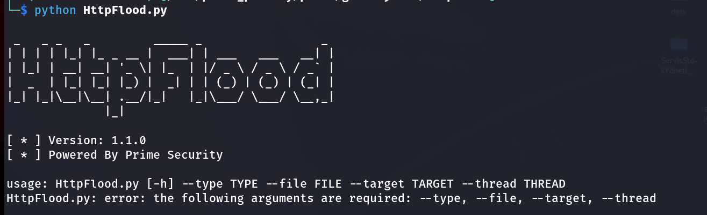

# HttpFlood 





<p>Http Get istekleri ile Hizmet Reddi ( DoS ) testleri yapmak için basit bir araç, multihtread özelliği ile gerçepe yakın senaryolar oluşturulabilir. </p>


## Gereksinimlerin Kurulması

```bash

# Windows 
python -m pip install requests

# Linux & Termux 
python3 -m pip install requests

```

## Kullanımı 

```bash
python3 HttpFlood.py --type http/https --file http_proxy_file.txt --target "http://test_flood.net" --thread count
```

Parametreleri incelersek `--type` ile istek yapılacak protokolü belirtmek gerekiyor `http` veya `https` sonrasında `--file` ile http proxy dosyamızı veriyoruz, `--target` ile hedefi` `--thread` bu parametre anlık kaç istek atılacak belirtir ev internetiniz ile 100 thread verirseniz internetinz çökecektir.

